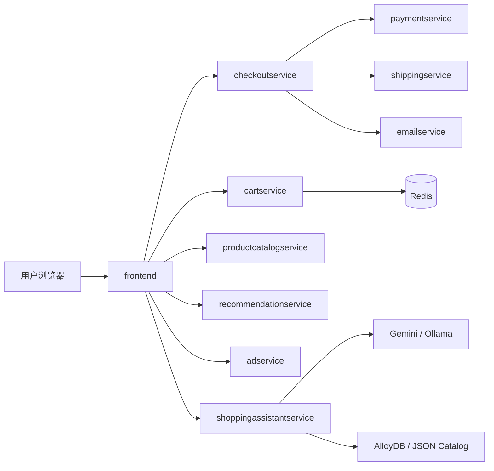

# however-microservices-lab - 微服务架构实践实验室 | Microservices Architecture Lab

<p align="center">
  
</p>

🔥 面向云原生工程实践的多语言微服务样例仓库。  
🚀 聚焦配置解耦、可观测性、可替换 AI 推理后端（Gemini/Ollama）和本地化部署。  
⭐ 适合作为微服务架构学习、二次开发与工程化改造基线。

<p align="center">
  
  
  
  
</p>

---

## 目录

- [1. 项目定位](#1-项目定位)
- [2. 改造目标](#2-改造目标)
- [3. 核心改动总览](#3-核心改动总览)
- [4. 微服务清单](#4-微服务清单)
- [5. 架构总览](#5-架构总览)
- [6. 项目结构](#6-项目结构)
- [7. 快速开始](#7-快速开始)
- [8. 配置说明（数据库/Redis/Ollama）](#8-配置说明数据库redisollama)
- [9. 部署方式](#9-部署方式)
- [10. 与原版差异](#10-与原版差异)
- [11. 仓库信息与协议](#11-仓库信息与协议)
- [12. 质量检测与验证](#12-质量检测与验证)

---

## 1. 项目定位

本仓库用于演示“多语言微服务在真实工程中如何持续演进”，重点不在单次跑通，而在长期可维护：

- 支持微服务之间通过 gRPC 协作，前端通过 HTTP 暴露业务入口。
- 支持 Kubernetes/Skaffold/Kustomize 多种部署路径。
- 支持 AI 助手服务按环境切换模型后端（Gemini 或 Ollama）。
- 支持关键地址配置外置，降低硬编码和环境耦合风险。

---

## 2. 改造目标

1. 建立统一的项目命名与命名空间规范。  
2. 将数据库、缓存、模型 API 地址全部参数化。  
3. 在不破坏主链路的前提下，提升依赖与配置可维护性。  
4. 对购物助手服务做结构化重构，支持扩展能力。  
5. 输出完整中文文档，便于交接与二开。

---

## 3. 核心改动总览

### 3.1 命名空间与构建标识

- `src/adservice` 已调整构建元信息：
  - `group`: `com.however.microservices`
  - `artifact`（通过 `settings.gradle`）：`however-adservice`
- Java 包声明已迁移：
  - `hipstershop.*` -> `com.however.microservices.adservice.*`

### 3.2 配置外置与本地化

- 新增 `configs/however.env.example`，统一管理本地化参数。
- `shoppingassistantservice` 新增可配置项：
  - `MODEL_PROVIDER=gemini|ollama`
  - `OLLAMA_BASE_URL` / `OLLAMA_MODEL`
  - `VECTORSTORE_BACKEND=alloydb|json`
  - `ALLOYDB_USER` / `ALLOYDB_PASSWORD` / `ALLOYDB_SECRET_NAME`

### 3.3 依赖与构建维护

- Node 服务 `currencyservice`、`paymentservice` 更新了项目元信息（名称、仓库、License、Node 版本约束）。
- Java `adservice` 启动脚本与 Docker 入口路径同步更新。

### 3.4 代码重构与新功能

`shoppingassistantservice` 已进行结构化拆分：

- `AppConfig`：统一配置读取
- `CatalogRetriever`：检索后端抽象（AlloyDB / JSON 回退）
- `DesignModelClient`：模型后端抽象（Gemini / Ollama）
- 新增 `GET /healthz`
- 新增本地兜底商品文件：`src/shoppingassistantservice/products.local.json`

---

## 4. 微服务清单

| 服务 | 语言 | 职责 |
|---|---|---|
| `frontend` | Go | Web 入口与页面渲染 |
| `cartservice` | C# | 购物车存储（Redis/替代后端） |
| `productcatalogservice` | Go | 商品目录检索 |
| `currencyservice` | Node.js | 汇率与货币转换 |
| `paymentservice` | Node.js | 支付模拟 |
| `shippingservice` | Go | 运费与配送模拟 |
| `emailservice` | Python | 订单邮件模拟 |
| `checkoutservice` | Go | 结算编排 |
| `recommendationservice` | Python | 推荐服务 |
| `adservice` | Java | 广告推荐服务 |
| `shoppingassistantservice` | Python | 图片/文本购物助手（可切换模型） |
| `loadgenerator` | Python | 压测流量生成 |

---

## 5. 架构总览



---

## 6. 项目结构

```text
.
├── README.md
├── LICENSE
├── LICENSE-HOWEVER.md
├── configs/
│   └── however.env.example
├── docs/
│   └── img/however-logo.svg
├── kustomize/
│   └── components/
│       ├── shopping-assistant/
│       └── local-endpoints/
└── src/
    ├── adservice/
    ├── shoppingassistantservice/
    ├── frontend/
    └── ...
```

---

## 7. 快速开始

### 7.1 本地准备

- Docker / Docker Compose
- Kubernetes（可选）
- `skaffold`（可选）

### 7.2 构建与运行（Kubernetes）

```bash
skaffold run
```

### 7.3 启用 loadgenerator

```bash
skaffold run --module loadgenerator
```

---

## 8. 配置说明（数据库/Redis/Ollama）

建议先复制配置模板并按环境覆盖：

```bash
cp configs/however.env.example .env.local
```

关键变量：

- Redis：`REDIS_ADDR`
- 模型后端：`MODEL_PROVIDER`, `OLLAMA_BASE_URL`, `OLLAMA_MODEL`
- 向量检索：`VECTORSTORE_BACKEND`, `VECTOR_TOP_K`
- AlloyDB：`PROJECT_ID`, `REGION`, `ALLOYDB_*`

`shoppingassistantservice` 配置逻辑：

1. `MODEL_PROVIDER=gemini` 时走 Gemini。  
2. `MODEL_PROVIDER=ollama` 时走本地 Ollama API。  
3. `VECTORSTORE_BACKEND=alloydb` 时使用 AlloyDB 向量检索。  
4. AlloyDB 不可用时自动回退 `products.local.json`。

---

## 9. 部署方式

### 9.1 默认部署

- 使用 `kubernetes-manifests` 或 `skaffold.yaml` 原生部署。

### 9.2 本地依赖覆盖部署

- 新增组件：`kustomize/components/local-endpoints`
- 用于切换到本地 Redis + Ollama + JSON 检索回退。

示例：

```yaml
components:
  - ../components/local-endpoints
```

---

## 10. 与原版差异

1. 增加 `however` 命名体系（构建标识与 Java 包）。  
2. 购物助手改为可切换模型后端（Gemini / Ollama）。  
3. 增加检索后端回退机制（AlloyDB -> JSON）。  
4. 增加本地化配置模板，敏感参数统一外置。  
5. 增加本地端点覆盖组件，减少清单硬改。  
6. 文档全面中文化并补充工程化说明。

---

## 11. 仓库信息与协议

- 上游协议：`LICENSE`（Apache-2.0）
- 本仓库衍生说明：`LICENSE-HOWEVER.md`
- 仓库描述 / Topics 建议：`.github/HOWEVER_REPO_PROFILE.md`

---

## 12. 质量检测与验证

统一检测入口：

```bash
bash scripts/checks/run_all_checks.sh
```

或使用 Makefile：

```bash
make check-all
```

相关文档：

- 落地清单：`docs/implementation-checklist.md`
- 测试说明：`docs/testing-and-quality.md`

## Baseline Maintenance

### Environment

- Put runtime credentials in environment variables.
- Use `.env.example` as the configuration template.

### CI

- `baseline-ci.yml` provides a unified pipeline with `lint + build + test + secret scan`.

### Repo Hygiene

- Keep generated files (`dist/`, `build/`, `__pycache__/`, `.idea/`, `.DS_Store`) out of version control.

