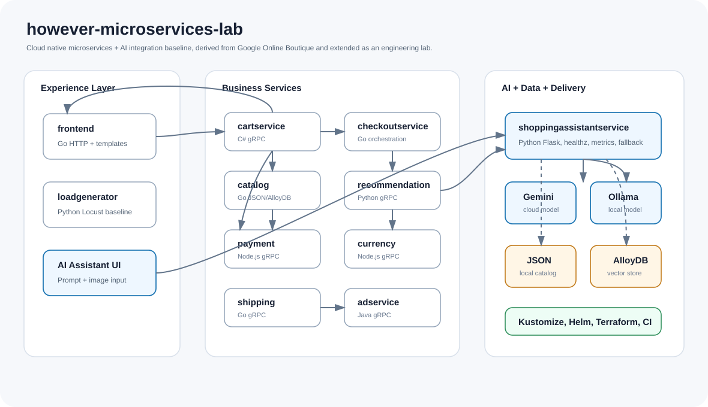
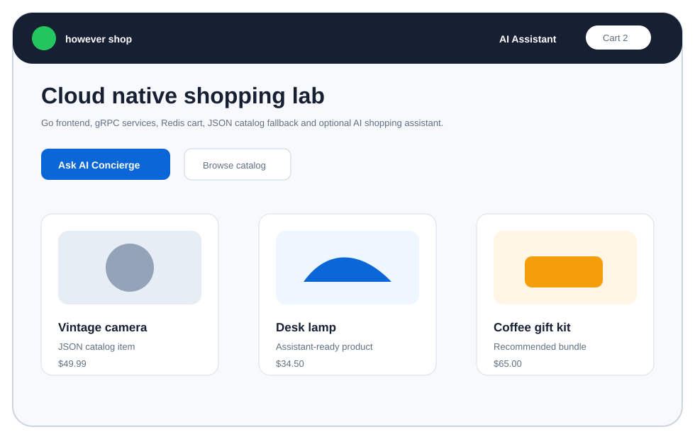
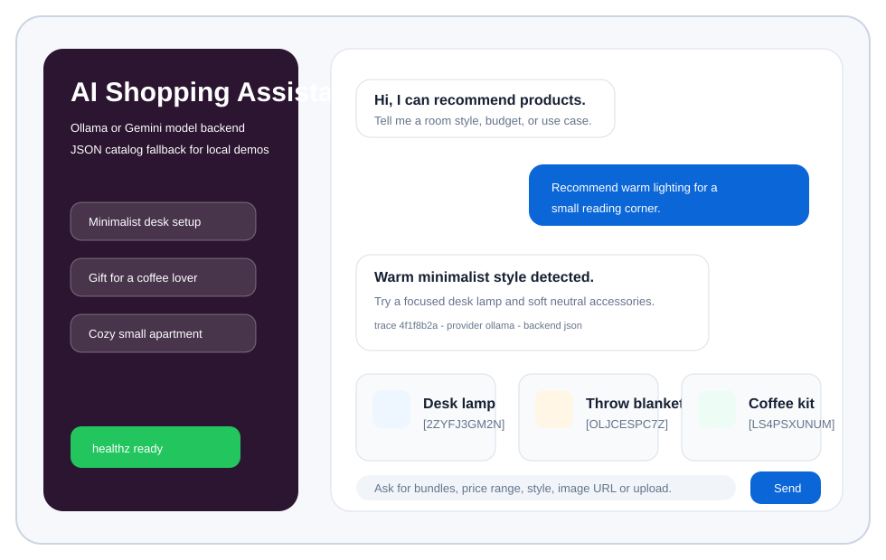
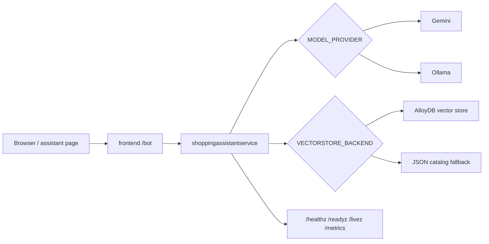

# however-microservices-lab

<p align="center">
  
</p>

`however-microservices-lab` 是一个“云原生微服务 + AI 集成实验室”。它基于 Google Online Boutique 的多语言微服务样例继续改造，但核心目标已经从“电商 demo”升级为“可展示工程能力的微服务改造样板”：AI Shopping Assistant、本地 Ollama、JSON catalog fallback、Kubernetes 部署、多语言服务测试和 CI 基线都放在同一个仓库里。

<p align="center">
  
  
  
  
  
  <br/>
  
</p>

## 首屏重点

| 能力 | 入口 | 说明 |
|---|---|---|
| AI Shopping Assistant | `src/shoppingassistantservice` + `/assistant` | Python Flask 助手服务接入 Go frontend，支持文本/图片输入、商品 ID 推荐、健康检查、指标、限流、熔断和降级 |
| 本地 Ollama 演示 | `make local-demo` | 本地 Redis + Ollama + JSON 商品数据，快速验证 `MODEL_PROVIDER=ollama` 和 `VECTORSTORE_BACKEND=json` |
| Kubernetes 部署 | `skaffold run` / `make check-e2e` | 原生 manifests、Kustomize components、kind smoke、Skaffold 构建部署 |
| 多语言工程矩阵 | Go / Python / Node.js / Java / C# | 保留电商主链路，同时补 AI 服务、质量测试和 CI 现代化 |



| Frontend | AI assistant |
|---|---|
|  |  |

## AI 工程作品矩阵

`however-microservices-lab` 是 however-yir AI 工程作品矩阵中的“云原生微服务 + AI 集成实验室”。这组主项目覆盖企业 RAG、业务 Agent、知识治理、AI 工程执行平台和云原生微服务集成五类方向。

| Repo | 定位 | 核心场景 | 技术重点 |
|---|---|---|---|
| [`knowledgeops-agent`](https://github.com/however-yir/knowledgeops-agent) | 企业级 Spring AI RAG 平台 | 企业知识问答、权限治理、可观测部署 | Spring AI、RAG、JWT/RBAC、异步入库、Observability |
| [`tianji-ai-agent`](https://github.com/however-yir/tianji-ai-agent) | 业务 Agent 工程案例 | 课程咨询、课程推荐、购买流程、多智能体路由 | Java、Spring AI、Tool Calling、MCP、SSE、多模态 |
| [`nebula-kb`](https://github.com/however-yir/nebula-kb) | 知识运营中枢 | 知识入库、知识治理、检索问答、反馈闭环 | Django、PostgreSQL、Redis、知识资产生命周期 |
| [`forgepilot-studio`](https://github.com/however-yir/forgepilot-studio) | AI 工程执行工作台 | AI 编程任务、执行编排、审计回放、团队工作台 | Python、FastAPI、React、Runtime Sandbox、MCP |
| [`however-microservices-lab`](https://github.com/however-yir/however-microservices-lab) | 云原生微服务 + AI 集成实验室 | 多语言微服务、Kubernetes、gRPC、AI 服务接入 | Go、Python、Java、Node.js、C#、K8s、Ollama/Gemini |

## 快速开始

### 1. 本地 AI 演示

```bash
make local-demo
curl -sS http://127.0.0.1:18081/healthz
```

需要真实 Ollama 推理时再拉模型：

```bash
LOCAL_DEMO_PULL_MODEL=1 make local-demo
curl -sS \
  -H "Content-Type: application/json" \
  -d '{"message":"Recommend warm lighting for a small reading corner","image":""}' \
  http://127.0.0.1:18081/
```

停止：

```bash
make local-demo-stop
```

完整说明见 [docs/local-demo.md](docs/local-demo.md)。

### 2. 本地 Kubernetes smoke

```bash
make check-e2e
```

该路径使用 kind + Skaffold + Kustomize，启用 AI assistant 和 mock Ollama，覆盖首页、商品页、加购、结算和 `/bot` 助手请求。手动步骤见 [docs/kind-skaffold-kustomize.md](docs/kind-skaffold-kustomize.md)。

### 3. 默认 Kubernetes 部署

```bash
skaffold run
kubectl port-forward deployment/frontend 8080:8080
```

访问 `http://127.0.0.1:8080`。

## 多语言服务矩阵

| 服务 | 语言 | 职责 | 改造重点 |
|---|---|---|---|
| `frontend` | Go | Web 入口、页面渲染、购物助手转发 | `/assistant`、`/bot`、商品元数据卡片 |
| `shoppingassistantservice` | Python | AI 购物助手 | Gemini/Ollama、JSON/AlloyDB 检索、healthz、metrics、fallback |
| `productcatalogservice` | Go | 商品目录 | JSON catalog、本地/AlloyDB 数据路径 |
| `cartservice` | C# | 购物车 | Redis/外部存储切换 |
| `checkoutservice` | Go | 结算编排 | gRPC 调用链和金额计算测试 |
| `paymentservice` | Node.js | 支付模拟 | Node 20、包元信息和基础测试 |
| `currencyservice` | Node.js | 汇率转换 | Node 20、汇率数据测试 |
| `shippingservice` | Go | 运费模拟 | Go 单测 |
| `emailservice` | Python | 邮件模拟 | Python gRPC 服务 |
| `recommendationservice` | Python | 商品推荐 | Python gRPC 服务 |
| `adservice` | Java | 广告推荐 | `com.however.microservices` 包迁移、Gradle/PMD |
| `loadgenerator` | Python | 性能流量 | Locust baseline |

## AI 助手设计


```mermaid
flowchart LR
  U["Browser / assistant page"] --> F["frontend /bot"]
  F --> SA["shoppingassistantservice"]
  SA --> M{"MODEL_PROVIDER"}
  M --> G["Gemini"]
  M --> O["Ollama"]
  SA --> R{"VECTORSTORE_BACKEND"}
  R --> A["AlloyDB vector store"]
  R --> J["JSON catalog fallback"]
  SA --> H["/healthz /readyz /livez /metrics"]
```

关键配置：

| 变量 | 作用 |
|---|---|
| `MODEL_PROVIDER=gemini\|ollama` | 切换云端 Gemini 或本地 Ollama |
| `OLLAMA_BASE_URL` / `OLLAMA_MODEL` | 本地模型端点和模型名 |
| `OLLAMA_ALLOWED_HOSTS` | 限制可访问的 Ollama host |
| `VECTORSTORE_BACKEND=alloydb\|json` | 切换 AlloyDB 向量检索或 JSON fallback |
| `PRODUCT_CATALOG_JSON` | JSON 商品数据路径 |
| `MAX_RETRIES` / `CIRCUIT_BREAKER_*` | 错误重试和降级保护 |

## 部署路径

| 路径 | 入口 | 场景 |
|---|---|---|
| Local demo | `make local-demo` | 本机 Redis/Ollama/JSON 助手演示 |
| Raw manifests | `kubernetes-manifests/` | 最小 Kubernetes 部署 |
| Kustomize | `kustomize/components/*` | AI assistant、local endpoints、network policies、cloud operations 等组合 |
| Skaffold | `skaffold.yaml` | 本地或 GKE 构建部署 |
| Helm | `helm-chart/` | 实验性 Helm 部署路径 |
| Terraform | `terraform/` | GKE + 可选 Memorystore 基础设施 |

## 与上游的差异

完整证据链见 [docs/diff-from-upstream.md](docs/diff-from-upstream.md)。摘要如下：

- 明确保留 Google Online Boutique 的 Apache-2.0 来源和多语言微服务基线。
- 迁移 however 命名空间、Java 包名、Gradle group、Node package 元信息和仓库 profile。
- 新增 AI Shopping Assistant，接入 frontend，并提供模型后端切换。
- 支持 Gemini/Ollama、AlloyDB/JSON catalog fallback。
- 新增本地 Redis + Ollama + JSON 演示路径。
- 增强 Kustomize components、Helm/Terraform 文档、kind smoke、loadgenerator 性能基线。
- 新增 `ubuntu-latest` 快速多语言 CI，并清理旧式 `::set-env`。

## 质量与 CI

本地快速检查：

```bash
make check-python
make check-node
make check-java
bash tests/repo_contract_test.sh
```

完整聚合入口：

```bash
make check-all
```

CI 入口：

- [.github/workflows/quick-ci.yaml](.github/workflows/quick-ci.yaml)：Go、Node、Python、Java 基础测试，运行在 `ubuntu-latest`。
- [.github/workflows/shoppingassistant-quality-ci.yaml](.github/workflows/shoppingassistant-quality-ci.yaml)：AI 助手 ruff/mypy/pytest。
- [.github/workflows/repo-contract-ci.yml](.github/workflows/repo-contract-ci.yml)：仓库质量契约。

## 性能基线

生成模板：

```bash
./scripts/perf/generate_baseline_report.sh reports/performance/baseline-latest.md
```

运行 `loadgenerator`：

```bash
skaffold run --module loadgenerator
kubectl logs -l app=loadgenerator -f
```

说明见 [docs/performance-baseline.md](docs/performance-baseline.md)。

## Release baseline

本仓库的第一条建议发布线是 `AI microservices lab baseline`，突出：

- 多语言微服务工程改造能力
- Kubernetes/Skaffold/Kustomize 部署能力
- Gemini/Ollama AI 服务集成能力
- JSON fallback 和错误降级质量能力

Release note 草稿见 [docs/releasing/ai-microservices-lab-baseline.md](docs/releasing/ai-microservices-lab-baseline.md)。

## 协议

- 上游协议：[LICENSE](LICENSE)
- however 衍生说明：[LICENSE-HOWEVER.md](LICENSE-HOWEVER.md)
