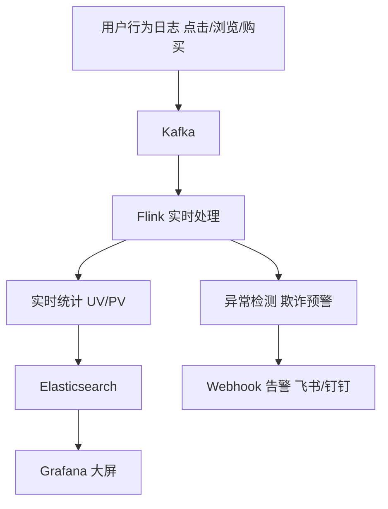
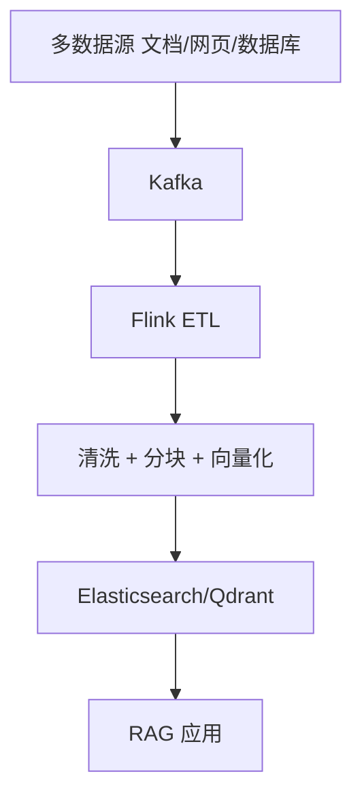
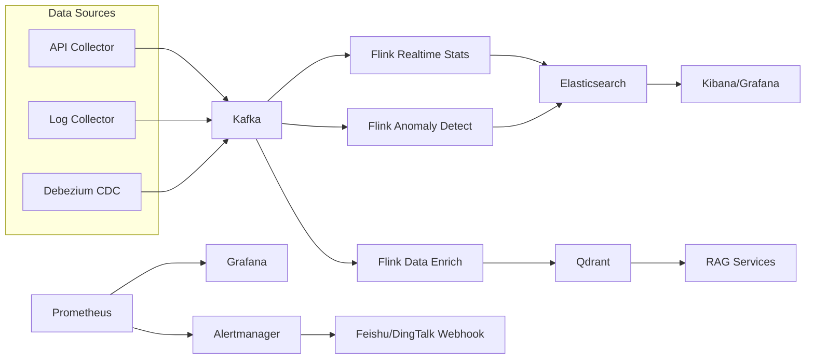

# Realtime Data Pipeline（实时数据流处理平台）

🔥 A production-style stream processing platform based on Kafka, Flink, Elasticsearch, and Prometheus.  
🚀 Built for real-time event ingestion, window aggregation, anomaly detection, and observability.  
⭐ Designed to integrate naturally with RAG pipelines: data ingestion -> cleaning -> chunking -> vectorization.

<p align="center">
  面向实时计算与 AI 数据管道的一体化工程骨架（采集 / 处理 / 存储 / 监控 / 告警）
</p>

<p align="center">
  
  
  
  
  
  
</p>

---

## 目录

- [1. 项目定位](#1-项目定位)
- [2. 场景设计](#2-场景设计)
- [3. 架构总览](#3-架构总览)
- [4. 技术亮点](#4-技术亮点)
- [5. 项目结构](#5-项目结构)
- [6. 快速开始](#6-快速开始)
- [7. 实时链路说明](#7-实时链路说明)
- [8. 与现有项目结合方式](#8-与现有项目结合方式)
- [9. 监控与告警](#9-监控与告警)
- [10. 开发路线图](#10-开发路线图)
- [11. 优化建议（30条）](#11-优化建议30条)
- [12. 参考文档](#12-参考文档)
- [13. License](#13-license)

---

## 1. 项目定位

`realtime-data-pipeline` 是一个可直接落地的实时数据流处理平台，目标是打通如下能力闭环：

- 多源采集：API / 日志 / 数据库 CDC
- 消息总线：Kafka 分区与主题治理
- 实时计算：Flink 窗口聚合、事件时间与水印
- 在线存储：Elasticsearch 检索分析 + Qdrant 向量检索
- 可观测性：Prometheus + Grafana + Alertmanager
- 实时告警：飞书/钉钉 Webhook 推送

与传统“离线 ETL 项目”相比，本项目强调低延迟、可扩展、可监控和可恢复，适合用于：

- 校园招聘/电商/内容平台的实时行为分析
- RAG 系统的数据实时入湖、清洗和向量化
- 流处理/大数据课程设计、项目展示和面试工程作品

---

## 2. 场景设计

### 2.1 场景一：电商实时数据大屏



关键产出：

- 分钟级 UV/PV 趋势
- 事件类型分布（product_viewed/assistant_recommended/add_to_cart/checkout_completed）
- 异常事件命中记录与告警通知

### 2.2 场景二：AI 数据管道（结合 RAG）



关键产出：

- 统一的文档增量采集入口
- 标准化 chunk 结构与 metadata
- 面向 RAG 的向量索引构建链路

---

## 3. 架构总览



---

## 4. 技术亮点

| 亮点 | 实现方式 | 完成度 |
|---|---|---|
| 消息队列 | Kafka 主题规划 + 分区策略 | ⭐⭐⭐⭐ |
| 流处理 | Flink 窗口聚合 + 水印机制 + DLQ | ⭐⭐⭐⭐ |
| CDC 同步 | Debezium Connector 模板 | ⭐⭐⭐⭐ |
| 实时计算 | 分钟级 PV/UV 实时统计 + 晚到数据处理 | ⭐⭐⭐⭐ |
| Exactly-Once | Checkpoint + 端到端语义配置 | ⭐⭐⭐⭐ |
| 容错恢复 | 状态后端 + 可重放消费链路 | ⭐⭐⭐⭐ |
| AI 融合 | 数据采集 -> 向量化 -> RAG 接入 | ⭐⭐⭐⭐⭐ |
| 安全加固 | 网络隔离 + 凭证外部化 + Schema 兼容性 | ⭐⭐⭐⭐ |
| 测试覆盖 | 16 Java 测试 + 11 Python 测试 + CI 全量跑通 | ⭐⭐⭐⭐ |
| 企业部署 | Dockerfiles + Helm v0.2.0 + 多环境配置 | ⭐⭐⭐⭐ |
| 可观测性 | 结构化日志 + 16 告警规则 + Runbook | ⭐⭐⭐⭐ |

---

## 5. 项目结构

```text
realtime-data-pipeline/
├── data-collector/
│   ├── log-collector/
│   ├── db-cdc/
│   └── api-collector/          (+ Dockerfile)
├── stream-processing/
│   ├── flink-jobs/
│   │   ├── realtime-stats/     (+ unit tests)
│   │   ├── data-enrich/        (+ unit tests)
│   │   └── anomaly-detect/     (+ DLQ + unit tests)
│   └── spark-streaming/
├── data-storage/
│   ├── kafka-config/
│   ├── elasticsearch/
│   └── qdrant/
├── monitoring/
│   ├── prometheus/
│   ├── grafana/
│   ├── alerting/               (+ 6 new alert rules)
│   ├── stream-metrics-exporter/ (+ Dockerfile, structured logging)
│   └── connect-exporter/       (+ Dockerfile, structured logging)
├── deploy/
│   └── helm/                   (v0.2.0, expanded)
├── docs/
│   ├── adr/                    (架构决策记录)
│   └── runbook/                (运维手册)
├── tests/                      (11 Python smoke tests)
├── .github/
│   ├── CODEOWNERS
│   └── workflows/
├── .env.example                (+ 安全配置变量)
└── docker-compose.yml          (+ 网络隔离 + 凭证外部化)
```

---

## 6. 快速开始

### 6.1 环境要求

- Docker + Docker Compose
- Java 11+
- Maven 3.8+
- Python 3.10+

### 6.2 配置环境变量并启动基础服务

```bash
cp .env.example .env
# 编辑 .env 设置 POSTGRES_PASSWORD 和 GF_ADMIN_PASSWORD（生产环境必须修改）
docker compose up -d
```

说明：

- `kafka-init` 会自动创建业务 topic 与 Kafka Connect 内部 topic
- `kafka-connect-init` 会自动注册 Debezium connector
- `schema-registry-init` 会自动注册 JSON Schema 契约
- `elasticsearch-init` 会自动应用 ILM policy 与 rollover template
- `qdrant-init` 会自动初始化 `rag_documents` 集合（`vector_size=128`）

### 6.3 启动采集模拟器

```bash
cd data-collector/api-collector
python3 -m venv .venv
source .venv/bin/activate
pip install -r requirements.txt
python3 producer.py
```

### 6.4 发送 RAG 文档样例（用于 data-enrich）

```bash
cd data-collector/api-collector
python3 rag_document_producer.py
```

### 6.5 构建并运行 Flink 实时统计任务

```bash
./scripts/run_realtime_stats.sh
```

说明：

- `docker-compose.yml` 已将 `stream-processing/flink-jobs/realtime-stats/target` 挂载到 Flink `usrlib`，不再需要手动 `docker cp`
- 脚本会先执行 `mvn -DskipTests clean package`，再自动提交最新构建出的 `realtime-stats-*.jar`
- 作业会输出窗口指标到 `realtime_stats_metrics`
- 解析失败消息会写入 `dlq_realtime_stats`

### 6.6 构建并运行 Flink data-enrich（分块 + 向量化 + Qdrant）

```bash
cd stream-processing/flink-jobs/data-enrich
mvn clean package -DskipTests

docker cp target/data-enrich-1.0.0.jar rdp-flink-jobmanager:/opt/flink/usrlib/data-enrich.jar
docker exec -it rdp-flink-jobmanager flink run /opt/flink/usrlib/data-enrich.jar \
  --kafka.bootstrap.servers kafka:29092 \
  --source.topic rag_raw_documents \
  --qdrant.url http://qdrant:6333 \
  --qdrant.collection rag_documents \
  --embedding.dim 128
```

可选：真实 Embedding（OpenAI/HTTP）：

```bash
docker exec -it rdp-flink-jobmanager flink run /opt/flink/usrlib/data-enrich.jar \
  --embedding.provider openai \
  --embedding.openai.model text-embedding-3-small \
  --embedding.openai.api.key "$OPENAI_API_KEY"
```

### 6.7 构建并运行 Flink CEP 异常检测任务

```bash
cd stream-processing/flink-jobs/anomaly-detect
mvn clean package -DskipTests

docker cp target/anomaly-detect-1.0.0.jar rdp-flink-jobmanager:/opt/flink/usrlib/anomaly-detect.jar
docker exec -it rdp-flink-jobmanager flink run /opt/flink/usrlib/anomaly-detect.jar
```

### 6.8 验证 CDC 一键启动

- Kafka Connect API:

```bash
curl http://localhost:8083/connectors
```

- 写入 PostgreSQL 后查看 CDC topic：

```bash
docker exec -it rdp-postgres psql -U postgres -d app -c \
  "INSERT INTO user_profile(user_name, city, tags) VALUES ('david', 'shenzhen', 'cdc,stream');"

docker exec -it rdp-kafka kafka-console-consumer \
  --bootstrap-server kafka:29092 \
  --topic cdc.public.user_profile \
  --from-beginning
```

### 6.9 校验 Schema Registry

```bash
curl http://localhost:8086/subjects
```

### 6.10 访问控制台

- Kafka UI: [http://localhost:8085](http://localhost:8085)
- Flink UI: [http://localhost:8081](http://localhost:8081)
- Kafka Connect: [http://localhost:8083](http://localhost:8083)
- Schema Registry: [http://localhost:8086](http://localhost:8086)
- Elasticsearch: [http://localhost:9200](http://localhost:9200)
- Kibana: [http://localhost:5601](http://localhost:5601)
- Prometheus: [http://localhost:9090](http://localhost:9090)
- Alertmanager: [http://localhost:9093](http://localhost:9093)
- Grafana: [http://localhost:3000](http://localhost:3000)

---

## 7. 实时链路说明

### 7.1 电商行为分析链路

1. frontend 或 `producer.py` 生成统一业务事件并写入 `user_behavior_events`。
2. API collector 的 HTTP 模式接收 `/events`，把 `product_viewed`、`assistant_recommended`、`add_to_cart`、`checkout_completed` 投递到 Kafka。
3. Flink 消费 Kafka 事件，按事件时间计算推荐点击率、加购转化率、checkout success rate 和异常序列。
4. `stream-metrics-exporter` 同步输出滚动业务指标，Grafana 读取 Prometheus 指标形成实时运营大屏。

frontend 接入 collector：

```bash
export BUSINESS_EVENT_COLLECTOR_URL=http://127.0.0.1:18088/events
export BUSINESS_EVENT_TENANT_ID=tenant_demo
```

手工发送一条事件：

```bash
curl -sS -X POST http://127.0.0.1:18088/events \
  -H "Content-Type: application/json" \
  -d '{"user_id":"demo-user","event_type":"product_viewed","product_id":"OLJCESPC7Z","channel":"web"}'
```

### 7.2 RAG 数据管道链路

1. API/CDC/日志源统一写入 Kafka。
2. `data-enrich` 作业完成清洗、结构化与分块。
3. Embedding 服务向量化后写入 Qdrant。
4. RAG 服务直接消费向量库，实时增强知识问答。

---

## 8. 与现有项目结合方式

| 现有项目 | 结合方式 |
|---|---|
| `ai-demo` | 作为文档采集与向量化入口，统一接入 Kafka 流水线 |
| `rag-agent-starter` | 复用 `rag_processed_chunks` 主题作为增量数据源 |
| `campus-recruitment` | 接入用户行为流，构建实时推荐与风控分析 |
| `yourrag/LZKB` | 做文档采集、清洗、分块、向量入库的实时化升级 |

---

## 9. 监控与告警

- Prometheus 负责指标采集与规则计算（新增 Qdrant/Elasticsearch 采集目标）
- Grafana 负责看板与可视化
- Alertmanager 负责告警路由
- `stream-metrics-exporter` 将 Kafka 行为事件转为业务指标（UV/PV/推荐点击率/加购转化率/checkout success rate/异常序列），支持结构化 JSON 日志与优雅停机
- `connect-monitor-exporter` 采集 Kafka Connect connector/task 运行状态，支持结构化 JSON 日志
- `scripts/send_webhook_alert.py` 用于手工验证飞书/钉钉机器人通知

### 告警规则（18条）

| 告警 | 级别 | 说明 |
|---|---|---|
| FlinkJobManagerDown | critical | JobManager 不可用 |
| PrometheusDown | critical | Prometheus 不可用 |
| KafkaConnectExporterDown | critical | Connect 监控不可用 |
| KafkaConnectTaskNotRunning | critical | Connect 任务异常 |
| ElasticsearchDown | critical | ES 不可用 |
| QdrantDown | critical | Qdrant 不可用 |
| BusinessAnomalySpike | critical | 异常事件激增 |
| KafkaConsumerLagHigh | warning | 消费堆积（总） |
| KafkaConsumerLagByGroup | warning | 消费堆积（按 group） |
| BusinessConversionDrop | warning | 转化率偏低 |
| CheckoutSuccessRateLow | warning | checkout 成功率偏低 |
| AbnormalBusinessSequenceSpike | warning | 异常业务序列增加 |
| EventParseFailureHigh | warning | 解析失败偏高 |
| IngestionSuccessRateLow | warning | 摄取成功率低于 SLO |
| PipelineLatencyP95High | warning | 端到端延迟超阈值 |
| FlinkCheckpointFailures | warning | Checkpoint 持续失败 |
| FlinkCheckpointDurationHigh | warning | Checkpoint 耗时过长 |
| DiskSpaceLow | warning | 磁盘空间不足 |
| CriticalAlertRecoverySlow | warning | 关键告警恢复超时 |

默认业务大屏：`Realtime Business Overview`

- UV/PV 看板
- 转化率趋势
- 异常事件趋势
- 漏斗分层（product_viewed/assistant_recommended/add_to_cart/checkout_completed）
- 渠道分层（app/web/mini_program）
- SLO 指标卡（摄取成功率、延迟 P95、frontend latency、assistant latency、Kafka lag、Flink checkpoint）
- Active Alerts 面板

示例：

```bash
export ALERT_WEBHOOK_URL="<your-webhook-url>"
python scripts/send_webhook_alert.py "[TEST] realtime pipeline alert"
```

---

## 10. 开发路线图

- [x] 单节点本地开发环境（Kafka/Flink/ES/Qdrant/监控）
- [x] 电商行为流实时统计样例
- [x] RAG 数据管道：分块 + 向量化 + Qdrant 入库
- [x] Debezium + Kafka Connect 一键部署（含 connector auto-init）
- [x] Grafana 实时业务大屏（UV/PV、转化率、异常告警面板）
- [x] Flink CEP 复杂事件检测落地
- [x] Schema Registry 契约管理 + 自动注册 + 兼容性策略
- [x] Elasticsearch ILM 生命周期策略
- [x] CI + Helm v0.2.0 部署骨架
- [x] 企业级加固：网络隔离 / 凭证外部化 / 测试覆盖 / Runbook
- [x] 18 条 Prometheus 告警规则 + 结构化日志 + 优雅停机
- [ ] Elasticsearch 与 Qdrant 双写生产化 sink
- [ ] GitOps 部署流程（ArgoCD/Flux）
- [ ] 混沌工程测试

---

## 11. 优化路线图

- [优化路线图（30条）](docs/optimization-roadmap.md)
- [企业级加固（50条）](docs/enterprise-hardening.md) — 涵盖安全/高可用/测试/可观测性/部署/性能/文档

---

## 12. 参考文档

- [架构说明](docs/architecture.md)
- [Kafka 实战指南](docs/kafka-guide.md)
- [Flink 教程](docs/flink-tutorial.md)
- [多租户策略](docs/multi-tenant-strategy.md)
- [SLO/SLI 基线](docs/slo-sli.md)
- [架构决策记录](docs/adr/)
- [运维手册](docs/runbook/)

---

## 13. License

MIT License
