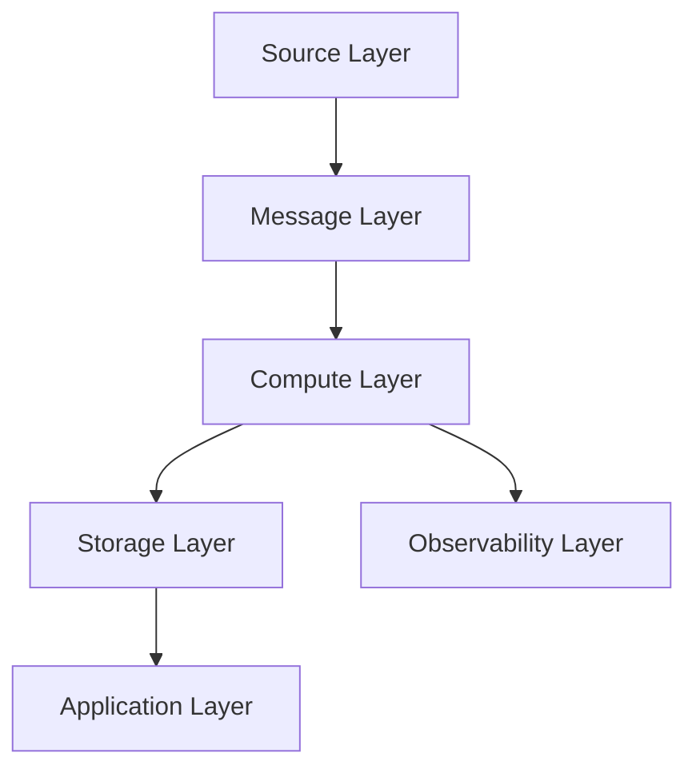
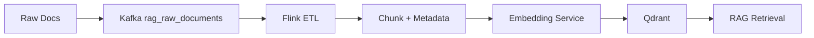

# Architecture Design

## 1. 设计目标

- 支持高吞吐低延迟的数据流处理
- 满足实时统计、实时异常检测、实时向量化三类任务
- 具备可观测、可恢复、可扩展能力

## 2. 分层设计

### 2.1 Source Layer

- API 拉取器
- 日志采集器（Fluent Bit）
- 数据库 CDC（Debezium）

### 2.2 Message Layer

- Kafka 作为统一入口
- 通过多 Topic 隔离不同域数据
- Schema Registry 管理 topic 契约（JSON Schema）
- 支持 topic namespace（`tenantA.user_behavior_events`）

### 2.3 Compute Layer

- Flink 实时统计作业（PV/UV）
- Flink 数据增强作业（清洗/分块/向量化）
- Flink 异常检测作业（规则/CEP/模型）

### 2.4 Storage Layer

- Elasticsearch：实时检索、聚合分析
- Qdrant：向量索引、语义检索

### 2.5 Observability Layer

- Prometheus：指标采集
- Grafana：可视化
- Alertmanager：告警收敛与推送
- Stream Metrics Exporter：Kafka 行为事件转业务指标（UV/PV/转化率/异常）
- Connect Monitor Exporter：采集 Kafka Connect connector/task 状态

## 3. 关键工程策略

### 3.1 Exactly-Once

- Flink Checkpoint + Kafka 事务语义
- 消费位点与状态一致性保存

### 3.2 容错恢复

- Checkpoint 周期化持久化
- 支持作业重启后的状态恢复

### 3.3 时序正确性

- 使用事件时间（Event Time）
- 水印处理乱序数据

### 3.4 扩展性

- 按主题与分区扩展 Kafka 吞吐
- 按并行度扩展 Flink 处理能力
- 按索引和分片扩展 ES 检索能力

## 4. AI/RAG 融合设计

通过流式管道替代离线批处理后，RAG 系统可以实现更快的知识更新与更稳定的增量同步。
